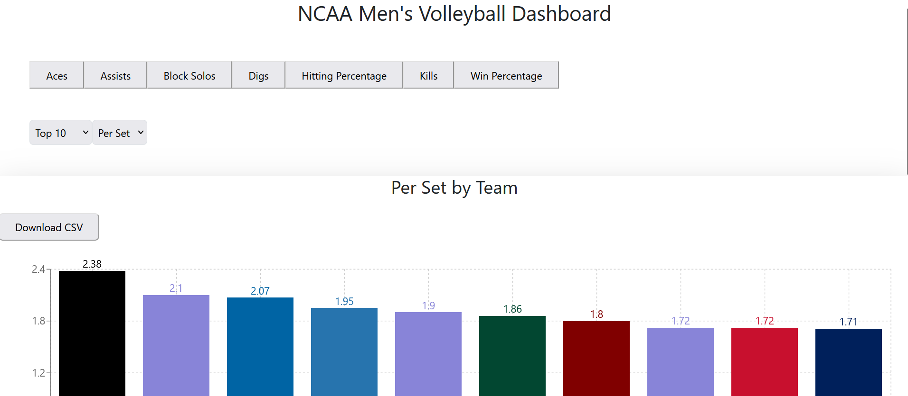
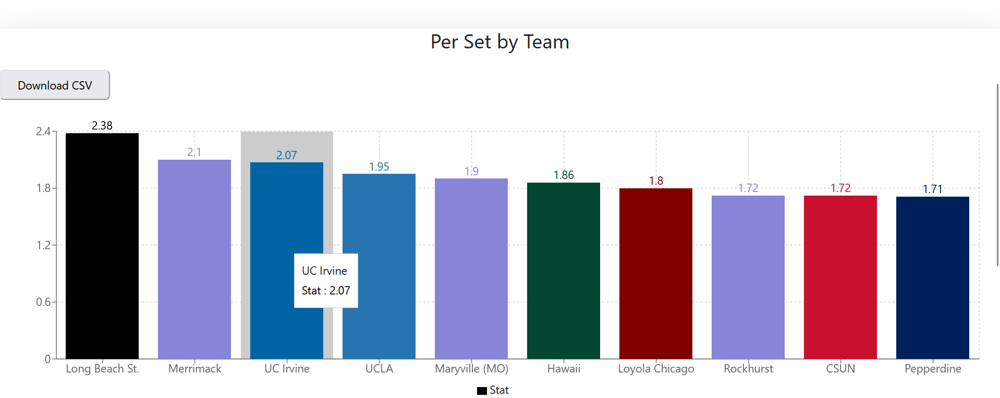
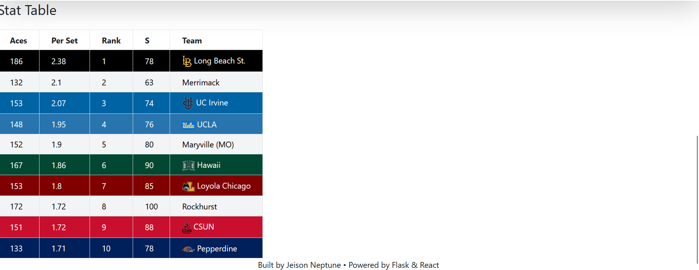

# NCAA Men’s Volleyball Data Dashboard 🏐📊

A full-stack interactive dashboard for visualizing NCAA Men’s Volleyball team statistics. Built using React (frontend), Flask (backend), and Pandas (data processing). Designed to automate data scraping, clean raw stats, and display them using dynamic, team-themed visuals.

##  Features

-  **Data Scraping:** Automatically retrieves up-to-date NCAA men's volleyball data weekly.
-  **Interactive Charts:** Displays team stats using bar charts with team logos and color schemes.
-  **Data Table:** Sortable, color-coded table of team performance stats.
-  **CSV Export:** Downloadable stats for external analysis or reporting.
-  **Tech Stack:** React, Flask, Pandas, Axios, Recharts, Tailwind CSS.

## 📸 Preview

  

  

  
*(Add your own screenshot to the `screenshots` folder and update the path above.)*

## 🚀 Getting Started

### Prerequisites

- Python 3.10+ (with Flask, Pandas)
- Node.js 18+ (with React, Tailwind)

### Backend Setup (Flask) 

```bash
cd backend
pip install -r requirements.txt
python app.py
```

### Frontend Setup (React)
```bash
cd frontend
npm install
npm run dev
```
### Access the Dashboard
Visit: http://localhost:3000

📂 Folder Structure

volleyball-dashboard/

├── backend/         # Flask API and data scraping logic

├── frontend/        # React app with chart components

├── screenshots/     # Images for README

└── README.md

💡 Future Improvements

    Add player-level statistics

    Deploy to a live server (e.g., Vercel + Render)

    Enable user filtering by team or stat type

👨‍💻 Author

Jeison Neptune
